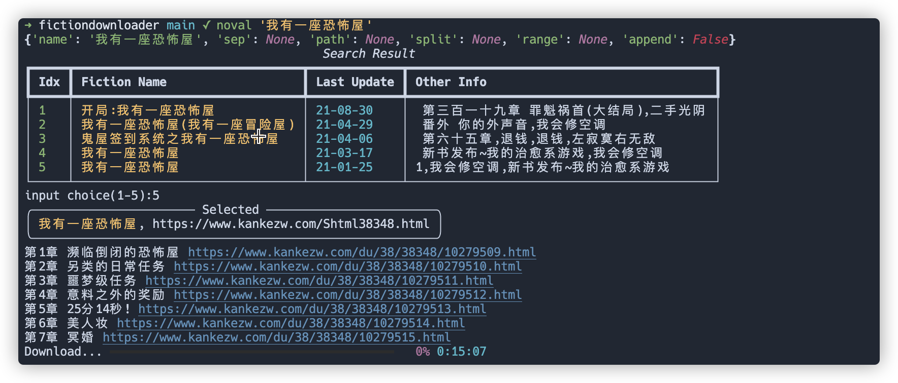

# noval

```
                       _
 _ __   _____   ____ _| |
| '_ \ / _ \ \ / / _` | |
| | | | (_) \ V / (_| | |
|_| |_|\___/ \_/ \__,_|_| Configurable novel downloader.
```



## Usage

`noval -h` to get help message.

```
usage: noval [-h] [--sep SEP] [--save-to path] [--range RANGE RANGE] [--split SPLIT | --append] [-v] name

positional arguments:
  name                 fiction name.

optional arguments:
  -h, --help           show this help message and exit
  --sep SEP            sleep time.
  --save-to path       custom fiction save path.
  --range RANGE RANGE  Download chapter range, like:`--range 10 20`
  --split SPLIT        Download segmented storage.
  --append             Whether it is in append mode. It is recreated by default.
  -v, --version        Show version and exit.
```

## Installation

### Pip

```
pip3 install noval --upgrade
```

### Source

```
git clone --dep 1 https://github.com/zlj-zz/noval.git
cd noval && python3 setup.py install
```

## Web-API

It encapsulates the functions in noval and provides a set of interfaces for
downloading novels. Can be used to build their own applications.

```
python3 -m noval.api
```
